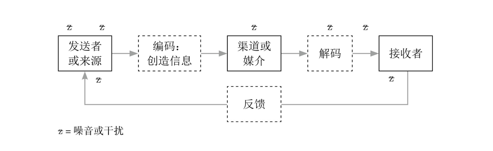

# 沟通的过程

# 沟通的四大目标

- 被接收（被听到或者被读到）
- 被理解
- 被接受
- 使对方采取行动（改变行为或态度）

*任何一个目标没有达到，沟通都是失败的*

# 文字的意义，个人诠释不同

1. 你如何称呼一样事物，取决于你生活的群体决定如何称呼它，而这个是无规律可循的
2. 抽象的词的意义，取决于个人的生活经验

# 非语言沟通

*列出我们自己在沟通时，还会有哪些方式*

- Non-verbal communication（meta-communication)
  - 面部表情：如一个皱眉，一个微笑
  - 肢体动作：利用双手或肢体的动作，解释或强调语言信息
  - 身体姿势：坐姿或站姿
  - 方向：面对对方，或背对对方
  - 目光接触：是否看着对方，或看着对方的时间长短
  - 肢体接触：拍背、搭肩
  - 距离：对方与自己的距离
  - 点头：表示同意或不同意，或鼓励对方说下去
  - 外表：外貌和衣着
  - 口头文字的非语言部分：音量、语调和语速的变化，音色和音质。
  - 书面文字的非语言部分：字迹、排版、组织、整洁和整体视觉印象

# 不同的情境，不同的诠释

- 人的行为是会相互影响的

# 沟通过程中的障碍

- 感受不同
- 妄下结论
- 刻板印象
- 缺乏兴趣
- 缺乏知识
- 表达困难
- 情绪
- 个性

# key

1. 我为什么要进行这个沟通？
2. 我沟通的真正原因是什么？
3. 我希望以此引起什么结果？改变对方的态度或看法？
4. 我希望沟通之后对方会做些什么？
5. 我的目的是什么？告知、说服、影响、教育、同情、娱乐、建议、解释还是刺激想法

# 对象

- 谁是我的听众（或者读者）
- 他们是什么样的人？他们有什么样的个性、教育背景、年龄、地位？
- 他们对信息内容可能会有什么样的反应？
- 他们对信息的主题已经了解多少？很多？不多？完全没有？比我知道的多或少？

# 时间和地点

- 对方会在哪里接收我的信息？在办公室里，随手就能取得相关数据；还是远离相关场所，所以我可能需要提醒他们相关的事实？
- 我的信息处在整个事件的哪个环节？我在回答对方的问题吗？这是对方第一次听到这个问题或主题吗？
- 我跟对方的关系如何？信息的主题是引起我们意见不合的原因吗？整个气氛是紧张还是和谐？
- 回答上面这些问题后，要回答下面这些问题也会更容易，比起直接跳到“我要说什么？”更有帮助

# 内容（主题）

- 我到底想说什么？
- 我需要说什么？
- 对方需要知道什么？
- 哪些信息我可以省略？
- 哪些信息我一定要包含，以达到：
  - clear
  - Constructive(积极)
  - concise
  - correct
  - Courteous
  - Complete

# 方式（语气和风格）

- 如何传达我的信息？用文字，用图片，还是两者都用？用什么样的文字，什么样的图片？
- 什么沟通媒介最合适？书面还是口头？电子邮件、便签或者一通电话？写信（电子邮件或书面邮件）还是碰面会谈？书面报告（通过网络寄送或邮寄）还是口头报告？
- 如何组织各项重点？使用演绎的方式（先提重点，然后说明/举例/图解),还会用归纳的方式（先说明/举例/举例，然后把重点归纳出来）？
- 如何达到预期的效果？我该采用什么语气，以达到目标？我应该采用或避免哪些字眼，以产生恰当的语气？

# 计划沟通内容的七大步骤

1. 写下目的
2. 收集信息
   - 只选择重要的相关信息
     1. 这跟我的信息真的有关系吗？
     2. 我的听众真的需要这些信息，才能理解我的信息吗？
     3. 这真的有助于我达到目标吗？
3. 把信息分类
   1. 自我检查，信息归类
   2. 每一段一个标题，一个段落应该只有一个主要的想法，段落中的其他内容是用来支撑这个想法的例子、细节、说明等。
4. 决定顺序（把笔记上的各个类别按某种逻辑顺序列出来，方便读者理解）
   - 按时间顺序：商务场合上需要处理的事务都有一个事件顺序
   - 按空间顺序：便于描述机械、建筑、家具、地理位置等。例如从北到南，从上到下，从左到右，从高到低，从内到外，从近到远
   - 按重要性：重要性递减法（演绎法）；重要性递增法（归纳法）
   - 复杂性递增法
   - 熟悉度递减法
   - 按因果关系
   - 按照主题
5. 制作大纲
6. 撰写初稿
7. 编辑初稿和完稿（站在对方的角度来阅读你的稿子。从对方的立场，看看有没有含糊不清、错误、用词别留的地方，有没有恰当的连接词，例如“首先”、“其次”、“最后”、“另一方面”、”因此“等，以协助对方掌握前后关系。力求简洁）
   - 变化句子的长度，不要过长。英语的话18-22词最佳
   - 一个段落，只表达一个主要的想法
   - 使用对方能理解的词语
   - 避免不正式的口语说法
   - 省略赘词
   - 用简短或常用的字眼来代替冗长的单词或词组
   - 避免陈腔滥调
   - 避免使用重复的单词和词组，尽量使用不同的表达
   - 用词中肯，不要言过其实
   - 多用正面积极的说法
   - 多用主动式

# 如何沟通

- 简短描述一个你自己经历过的沟通情境，列出哪些因素使得正确的信息无法传递给对方。
- 有哪些因素可能会阻碍两个说同一种语言的人之间的沟通